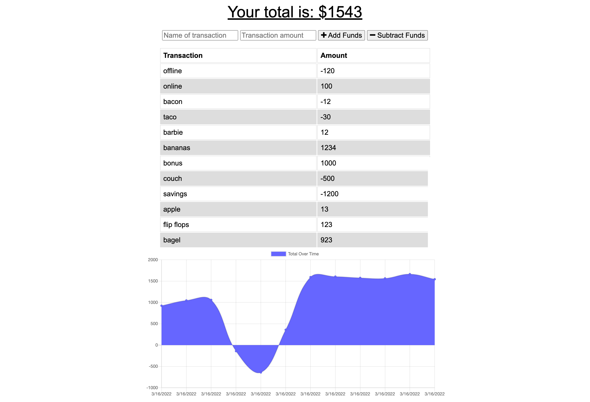

# challenge-nineteen-PWA
Challenge 19 of the bootcamp, where we were tasked with update an existing budget tracker application to allow for offline functionality. When the user logs on, anything they did while offline will load into the app.

## What is this?
This is our first challenge converting a pre-existing app into a Progressive Web Application, or PWA. It's a budget tracker that allows users to add funds, delete funds, and view their finances over time regardless of if thy have network access or not.

## What is the point?
The point of this app is to allow users to add, delete and view transactions whether or not they are online. While offline, their transactions are held temporarily until they gain network access once again. From here, these transactions are loaded into the app.

## Stack?
Frontend:
- HTML
- CSS
Backend:
- Javascript
- Chrome DevTools for measuring web application performance
- Google Lighthouse for scoring app performance
- PWA for creating a mobile application

## How did I build it?
I built this app off of the start code provided. My first step was to create the offline persistence using IndexedDB. Next I configured the service workers to handle the offline functionality of holding onto the data/transactions. Thirdly, I converted it into a PWA that could be installed on your phone. Finally I deployed this application to Heroku.

## What does it look like and where can I find it?
You can find this app on my github at the Repository (https://github.com/mmlawton15/challenge-nineteen-PWA-applesauce/tree/main) or on Heroku (https://git.heroku.com/powerful-forest-47276.git).

